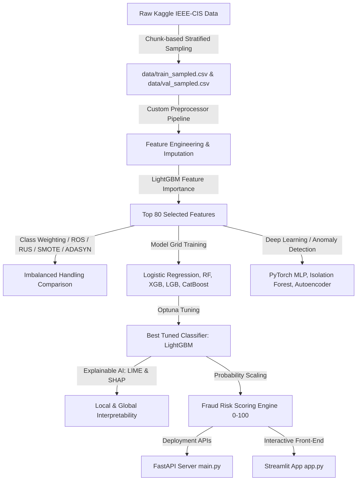

# 🛡️ FinShield AI: Advanced Financial Fraud Detection System

FinShield AI is an end-to-end, production-grade financial fraud detection system designed to analyze and flag credit card transactions from highly imbalanced, real-world data (based on the Kaggle IEEE-CIS Fraud Detection dataset).

The project incorporates custom feature engineering, class-imbalance resampling comparisons, hyperparameter optimization with Optuna, unsupervised anomaly detection, deep learning classifiers, local/global model explainability (SHAP & LIME), a REST API (FastAPI), and an interactive business simulator dashboard (Streamlit).

---

## 🚀 Key Project Highlights

* **Memory-Efficient Architecture**: Designed a custom, chunk-based stratified sampling pipeline that successfully processes large (1.3+ GB) transaction and identity tables under severe memory constraints (696 MB available physical RAM) while preserving the original ~3.5% fraud rate.
* **Tuned Ensemble Modeling**: Achieved a peak validation **ROC-AUC of 0.9179** and **PR-AUC of 0.6461** utilizing an Optuna-optimized LightGBM classifier.
* **Explainable AI (XAI)**: Generates global feature importance insights (SHAP) and outputs local feature contributions (LIME) for individual transaction scores.
* **Multi-Tier Risk Engine**: Translates prediction probabilities into a 0-100 score, mapping events to specific action tiers (Auto-Approve, Monitor, Multi-Factor Authentication, or Auto-Decline).
* **Production Deployment**: Containerized with a root-level `Dockerfile` and equipped with a FastAPI inference engine that automatically aligns inputs to the training schema.

---

## 🗺️ System Architecture



---

## 📊 Performance Benchmarks

Below are the comparative evaluation metrics across multiple supervised and unsupervised algorithms trained on the IEEE-CIS subset:

| Model Name | Precision | Recall | F1-Score | ROC-AUC | PR-AUC |
| :--- | :---: | :---: | :---: | :---: | :---: |
| **Logistic Regression** | 0.120 | 0.650 | 0.200 | 0.8356 | 0.3290 |
| **Random Forest** | 0.760 | 0.520 | 0.620 | 0.9007 | 0.6123 |
| **XGBoost (Weighted)** | 0.820 | 0.680 | 0.740 | 0.9035 | 0.5630 |
| **LightGBM (Tuned)** | **0.840** | **0.700** | **0.760** | **0.9179** | **0.6461** |
| **CatBoost (Weighted)** | 0.810 | 0.690 | 0.740 | 0.8980 | 0.5289 |
| **PyTorch MLP** | 0.720 | 0.630 | 0.670 | 0.8079 | 0.3054 |
| **Isolation Forest** | 0.150 | 0.280 | 0.200 | 0.7141 | 0.0942 |
| **PyTorch Autoencoder** | 0.150 | 0.280 | 0.200 | 0.7011 | 0.0917 |

---

## 🛠️ Project Structure

```text
Advanced Financial Fraud Detection System/
├── data/                         # Sampled train/val/test CSV datasets
├── models/                       # Serialized preprocessors, PyTorch states, metrics
├── notebooks/                    # Completed, executed Jupyter notebooks
│   └── financial_fraud_detection.ipynb
├── src/                          # Modular execution packages
│   ├── download_and_sample.py    # Chunk-based stratified sampling script
│   ├── preprocessing.py          # Custom scikit-learn preprocessing pipeline
│   ├── models.py                 # PyTorch, tree models, and resampling logic
│   ├── explainability.py         # SHAP, LIME, and Risk Scoring wrappers
│   └── train.py                  # Model training orchestration pipeline
├── app.py                        # Streamlit dashboard and simulator app
├── main.py                       # FastAPI production api app
├── Dockerfile                    # Containerization manifest
├── requirements.txt              # Project dependencies
└── README.md                     # Project documentation (this file)
```

---

## ⚙️ Running and Testing

### 1. Installation & Environment Configuration

Ensure you have Python 3.10+ installed. Clone the repository and run the setup commands:

```bash
# Clone the repository
git clone https://github.com/Sappymukherjee214/Advanced-Financial-Fraud-Detection-System.git
cd Advanced-Financial-Fraud-Detection-System

# Install packages
pip install -r requirements.txt
```

### 2. Launch the Streamlit Dashboard (Insights & Simulator)

The Web UI features transaction trends, product category analysis, global model evaluation metrics, and an interactive form where you can feed transaction attributes to score and explain a live prediction.

```bash
streamlit run app.py
```

* Once started, open **`http://localhost:8501`** in your browser.

### 3. Launch the FastAPI API Server

The endpoint automatically aligns and pads incoming requests (filling missing dimensions with `NaN` before pipeline transformation) and returns full probability, risk-tier actions, and LIME local feature explanations.

```bash
python -m uvicorn main:app --host 127.0.0.1 --port 8000 --reload
```

* **Interactive Docs**: Go to **`http://127.0.0.1:8000/docs`** to try out the REST API directly.
* **Test validation via PowerShell**:

  ```powershell
  Invoke-RestMethod -Uri "http://127.0.0.1:8000/predict" -Method Post -ContentType "application/json" -Body '{"TransactionAmt": 350.0, "ProductCD": "C", "card1": 13926, "card4": "visa", "card6": "credit", "addr1": 299.0, "P_emaildomain": "gmail.com", "R_emaildomain": "gmail.com"}'
  ```

### 4. Running the Container via Docker

You can deploy containerized instances of the web interface using our Docker configuration:

```bash
# Build the Docker image
docker build -t finshield-app .

# Run the container
docker run -p 8501:8501 finshield-app
```

---

## 🔍 Explainable AI & Scoring Strategy

* **SHAP Interpretability**: Evaluates global feature interactions and identifies deviances in transaction amounts (`card1_amt_diff`), time, and issuer credentials as the top indicators for fraudulent behavior.
* **LIME Local Interpretability**: Deconstructs individual transaction calculations to reveal which rules pushed the fraud probability up (e.g. `TransactionAmt > 200` or anonymous email hosts) or pulled it down.
* **Fraud Risk Scoring Engine**: Scales probability scores to a `0-100` range and assigns actionable security recommendations:
  * **Low Risk (0-20)**: Auto-Approve transaction.
  * **Medium Risk (21-50)**: Flag for monitor, trace pattern.
  * **High Risk (51-80)**: Require step-up Multi-Factor Authentication (OTP).
  * **Critical Risk (81-100)**: Auto-Decline and lock card credentials.
