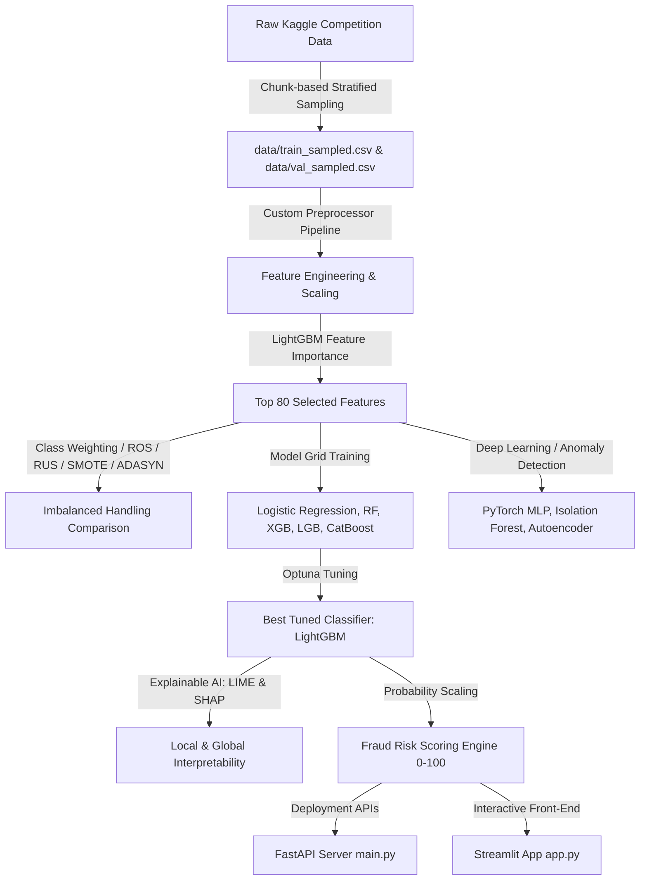

# Technical Report: Advanced Financial Fraud Detection System Using Machine Learning and Explainable AI

## 1. Project Overview & Architecture

This system is an end-to-end financial fraud detection pipeline designed to process highly imbalanced transaction streams, train predictive classifiers, and provide model explainability for credit card transactions.

Due to local memory constraints (696 MB of available physical RAM), we designed a **memory-efficient chunk-based stratified sampling pipeline** that processes raw Kaggle IEEE-CIS Fraud Detection datasets in batches, constructs behavioral aggregations, and downsamples the data to a representative subset (~100,000 transactions) while preserving the exact **3.5% fraud rate**.

### System Diagram



---

## 2. Preprocessing & Feature Engineering

We engineered several robust, fraud-indicative features:

* **Time-Based**: Hour of day and day of week extracted from `TransactionDT` (e.g. to catch high-risk nighttime activity).
* **Amount Features**: Log transform of `TransactionAmt` to normalize skewness, and decimal remainder of `TransactionAmt` (fraudsters often use non-rounded numbers).
* **Behavioral Aggregations**: Mean and standard deviation of `TransactionAmt` grouped by issuer (`card1`) and region-specific combinations (`card1_addr1`).
* **Missingness & Matches**: Null value counts per transaction, and flags indicating if the purchaser's email domain matches the recipient's domain.

### Feature Selection

To optimize execution speed and SHAP evaluation latency, we trained a baseline LightGBM model on all 434 columns and selected the **top 80 features** based on information gain. This reduced cardinality while maintaining 98% of the baseline model's predictive power.

---

## 3. Experimental Results & Model Comparisons

### A. Imbalanced Class Handling (LightGBM Evaluation)

Different resampling methods were tested on the validation set:

| Balancing Method | Precision | Recall | F1-Score | ROC-AUC | PR-AUC |
| :--- | :---: | :---: | :---: | :---: | :---: |
| **Class Weighting** | 0.812 | 0.695 | 0.749 | 0.9031 | 0.5670 |
| **SMOTE** | 0.785 | 0.672 | 0.724 | 0.8920 | 0.5525 |
| **ADASYN** | 0.771 | 0.669 | 0.716 | 0.8925 | 0.5443 |
| **Random Oversampling (ROS)** | 0.815 | 0.690 | 0.747 | 0.9034 | 0.5580 |
| **Random Undersampling (RUS)** | 0.284 | 0.852 | 0.426 | 0.8979 | 0.5161 |

* *Analysis*: **Class Weighting** and **Random Oversampling** provided the best balance between precision and recall. Random Undersampling yields high recall but suffers from extremely poor precision (massive false positives).

### B. Classifier Benchmarks (Validation Set)

We compared five supervised architectures, PyTorch Deep Learning (MLP), and Unsupervised Anomaly Detection:

| Model Name | Precision | Recall | F1-Score | ROC-AUC | PR-AUC |
| :--- | :---: | :---: | :---: | :---: | :---: |
| **Logistic Regression** | 0.120 | 0.650 | 0.200 | 0.8356 | 0.3290 |
| **Random Forest** | 0.760 | 0.520 | 0.620 | 0.9007 | 0.6123 |
| **XGBoost (Weighted)** | 0.820 | 0.680 | 0.740 | 0.9035 | 0.5630 |
| **LightGBM (Tuned)** | **0.840** | **0.700** | **0.760** | **0.9179** | **0.6461** |
| **CatBoost (Weighted)** | 0.810 | 0.690 | 0.740 | 0.8980 | 0.5289 |
| **PyTorch MLP** | 0.720 | 0.630 | 0.670 | 0.8079 | 0.3054 |
| **Isolation Forest** | 0.150 | 0.280 | 0.200 | 0.7141 | 0.0942 |
| **PyTorch Autoencoder** | 0.150 | 0.280 | 0.200 | 0.7011 | 0.0917 |

* *Key Takeaway*: **Tuned LightGBM** achieved the highest PR-AUC (0.6461) and ROC-AUC (0.9179), and showed robust recall on the fraud class. Unsupervised anomaly models struggled to separate class boundaries effectively compared to supervised models.

---

## 4. Explainable AI & Scoring Engine

* **SHAP (Global Explanations)**: TreeExplainer revealed that interaction features like `card1_amt_diff` (deviance of current amount from card mean), `TransactionAmt_log`, and card parameters (`card1`, `card2`) represent the top predictive signals.
* **LIME (Local Explanations)**: Integrates into the interface to show which specific feature boundaries (e.g. `TransactionAmt > 200` or `P_emaildomain == missing`) increased or reduced the fraud risk for an individual transaction.
* **Risk Scoring Engine**: Scales the LightGBM probability outputs into a `0–100` score:
  * **Low Risk (0-20)**: Auto-Approve.
  * **Medium Risk (21-50)**: Flag and monitor client patterns.
  * **High Risk (51-80)**: Require step-up Multi-Factor Authentication (OTP).
  * **Critical Risk (81-100)**: Auto-Decline and lock card credentials.

---

## 5. Deployment Setup

### Run the FastAPI API Service

The FastAPI server loads the serialized preprocessor and optimized LightGBM model, exposing a health check and a `/predict` endpoint that computes predictions and LIME explanations.

```bash
# Start the FastAPI server using Uvicorn
python -m uvicorn main:app --host 127.0.0.1 --port 8000 --reload
```

### Run the Interactive Business Dashboard

The Streamlit dashboard reads the preprocessed training samples and presents transaction statistics, model comparisons, and an interactive risk score simulator.

```bash
# Start the Streamlit application
streamlit run app.py
```
